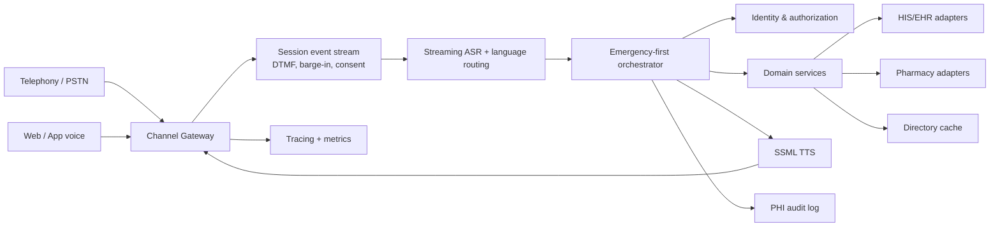
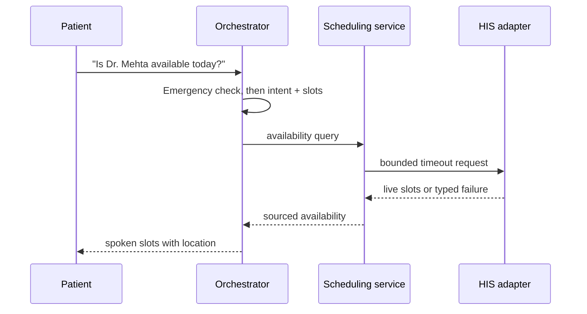
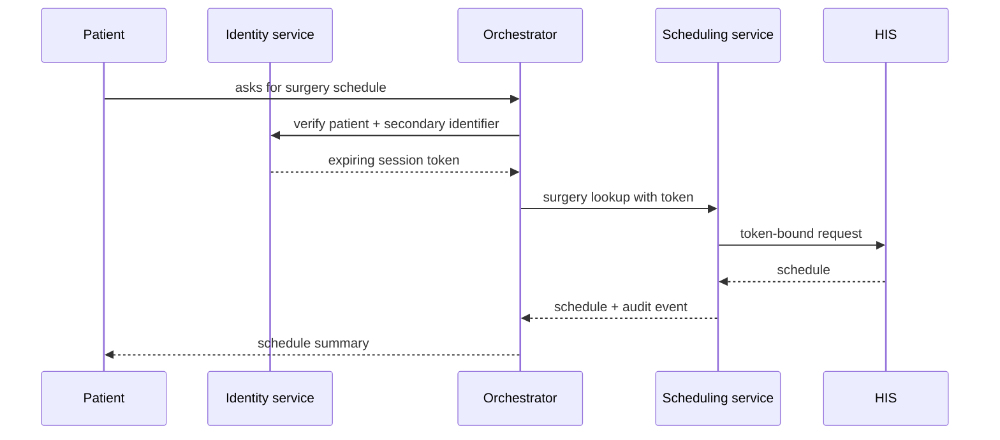
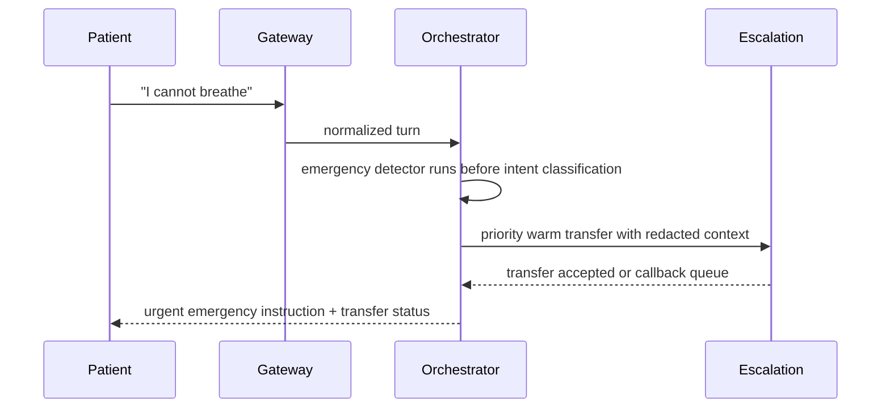

# Arogya Assist healthcare backend

This design treats the voice agent as a safety-critical information gateway. It never invents live hospital data, exposes report contents to voice, or returns patient-specific data without a session-scoped identity token.

## Component diagram



## API contracts

All patient-specific endpoints require `Authorization: Bearer <session-scoped-token>`. Raw patient IDs are never accepted as authorization.

### Session and consent

`POST /api/healthcare/session`

```json
{ "channel": "web", "language": "en-IN", "consented": true }
```

Returns `{ session, consent }`, with a 30-minute expiry and the automated disclosure recorded against the session.

### Identity

`POST /identity/verify_patient` accepts `{ sessionId, patientId, secondaryIdentifier }`. It returns `{ verified, token, expiresAt }` only after verification. Two failed attempts lock the session; repeated failures are alerted as possible enumeration. Proxy access is a separate pre-enrolled credential flow.

### Scheduling

`GET /scheduling/doctors/:doctorId/availability` returns `{ doctorName, department, slots, location }`. The service reads the HIS adapter directly and includes a source trace. Booking and surgery lookup use the same adapter contract but require the identity token.

### Reports

`GET /reports/:reportId/status` returns only `{ reportId, status, expectedDate }`. The report service type has no `contents`, `diagnosis`, or document payload field, so report contents cannot reach the voice layer by contract.

### Pharmacy

`GET /pharmacy/:medicine/availability` returns `{ medicineName, locations: [{ name, available }] }`. It contains no dosage or medical-advice fields.

### Escalation

`POST /escalation` accepts a redacted session summary and priority (`emergency` or `routine`). It returns a warm-transfer status or callback queue position.

## Core sequences

### Doctor availability



### Verified surgery schedule



### Emergency detected mid-call



## Failure modes

| Component | Failure | Expected behavior |
|---|---|---|
| Telephony | Provider outage | Show app fallback, callback offer, and status page; never drop silently |
| Gateway | DTMF/voice mismatch | Offer press-1 fallback and repeat consent disclosure |
| ASR | Low confidence | Ask a short clarification; never call a domain tool |
| TTS | Degraded | Switch to text/DTMF and offer human transfer |
| Orchestrator | Timeout | Say the check is unavailable and offer reception/callback |
| Identity | Two failed attempts | Lock session; alert on repeated cross-session failures |
| HIS | Timeout or circuit open | Typed integration failure; no guessed availability |
| Pharmacy | API unavailable | Offer nearby reception callback; do not infer stock |
| Escalation | No agent available | Return queue position and callback offer |
| Audit | Write failure | Fail closed for PHI reads; surface operational alert |

## Suggested stack tradeoffs

- **Telephony:** Twilio Voice is fast for PSTN and DTMF; LiveKit is stronger for low-latency WebRTC and barge-in; a SIP provider offers more carrier control but increases operations.
- **ASR/TTS:** Deepgram plus ElevenLabs provides strong streaming and expressive SSML; Google Cloud Speech is a broad multilingual alternative; self-hosted models improve control but require GPU operations.
- **Orchestration:** A typed TypeScript state machine is easiest to audit; the AI SDK can generate natural language around deterministic tool results; a durable workflow engine is useful for callbacks and long-running escalation.
- **Event bus:** Vercel Workflow or a managed queue is simple for durable handoffs; Kafka is appropriate for high-volume replayable events but adds platform overhead.

## Security and operations

Use TLS for every hop, encrypted database storage, short-lived hashed session tokens, redacted observability payloads, structured audit events, and infrastructure TTL jobs for transcripts and identity attempts. Add distributed tracing keyed by session ID, alerts for emergency-transfer failures and ASR-confidence drops, circuit breakers with explicit timeout budgets, and contract tests that reject unsourced scheduling, pharmacy, or report-content responses.
